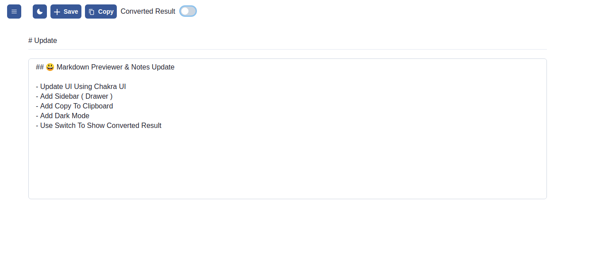

| Raw Text (Light Mode)| Converted Text (Dark Mode)|
| ----------- | ----------- |
|  |  |
## 🤔 Apa Itu Markdown Previewer 

Markdown Previewer adalah sebuah tools yang dibuat untuk melakukan manipulasi text dalam format 
MD (Markdown),


## 🤨 Fitur Apa Saja Yang Tersedia

- Konversi Markdown -> Plain Text
- Simpan Note
- Hapus Note
- Dark Mode
- Copy To Clipboard


## :computer: Cara Install

```bash
git clone https://github.com/AlFarizzi/markdown-previewer.git
or
download zip
cd /to/markdown-previewer/path
npm install
npm start
```